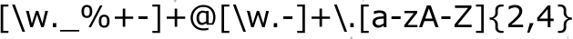

```{r setup, include=FALSE, message=FALSE, warning = FALSE}
knitr::opts_chunk$set(echo = TRUE)
library(tidyverse)
```

## Regular Expressions 



---

## [xkcd #208](https://xkcd.com/208/)


---

## Regular Expressions

- Regular expressions (regex, regexp) is a sequence of characters that form a search pattern

- Originated in 1950s. American mathematician Stephen Kleene formalized the description of a regular language.

-  Common usage with Unix text processing utilities ed, an editor, and grep (global regular expression print), a filter.

- R language provides this capability through `grep`, `gsub`, ...

---
## Example: State names

`state.name` is a built in dataset within R that contains all the U.S. state names.

```{r}
data(state)
```

How many state names contain the pattern "ne"?

```{r}
grep(pattern = "ne", state.name)

state.name[7]

grep(pattern = "ne", state.name, value = TRUE)

```

---

## Example

We don’t care about the casing so we will make our pattern more promiscuous.

```{r}
grep(pattern = "[nN]e", state.name, value = TRUE)

```

---

## Basics of regular expressions

| expression          | meaning          |
----------------------------|:---------------------------- |
| ordinary characters | match themselves |
|  `$ ^ { [ ( ) ] } * + ? \`      |   special characters    |
| `[abc]` | matches single letter from "a", "b", or "c" |
| `[^abc]` | matches any single letter other than "a", "b", and "c" |
| `[a-gm]` | matches any single letter out of "a", "b", ... "g" or "m" |
| `[a-z][0-9]`   | matches one lower case letter followed by a digit|

---

## Basics of regular expressions (cont'd)

| expression          | meaning          |
----------------------------|:---------------------------- |
| `\x` | match a hexadecimal number |
| `\s` | whitespace |
| ^ | starting position within the string |
| $ | ending position with in the string |
| `< >` | start, end of a word |
| `\t \r \v \n` | tab, carriage return, vertical tab, new line |

---
## Multipliers

- `?` indicates there is **zero or one** of the preceding element, eg `colou?r` matches "color" or "colour"

- `*` indicates there is **zero or more** of the preceding element, eg `ab*c` matches "ac", "abc", "abbc", "abbbc", ...

- `+` indicates there is **one or more** of the preceding element, eg `ab+c` matches "abc", "abbc", "abbbc", ...

- `.` matches any **single** character, eg `a.c` matches "abc" or "atc"

- `{n}` indicates the preceding element is matched exactly *n* times

- `{n,}` indicates the preceding element is matched *n* or more times

- `{n,m}` indicates the preceding element is matched at least *n* times, but not more than *m* times


---
## Advanced Patterns

see `?regex`

* `[:alpha:]` Any alphabetic character

* `[:lower:]` Any lowercase character

* `[:upper:]` Any uppercase character

* `[:digit:]` Any digit

* `[:alnum:]` Any alphanumeric character (alphabetic or digit)

* `[:blank:]` Any white space character (space, tab, vertical tab)

* `[:graph:]` Any printable character, except space

* `[:print:]` Any printable character, including the space

* `[:punct:]` Any punctuation (i.e., a printable character that is not white space or alphanumeric)

* `[:cntrl:]` Any nonprintable character

---

## Examples

What do these regular expressions do?

`.at`

`[hc]at`

`[^t]at`

`[^hc]at`

`^[S]tat`

`[S]tat$`


---

## Trickier Examples

What do these regular expressions do?

`^s.*`

`[A-Z]\{3,\}`

`\[.\]`

`[bB]ar ?[cC]hart`

`^[0-9]{5}$`

`^(\d{3}-\d{3}-\d{4})*$`

`(\w[-._\w]*\w@\w[-._\w]*\w\.\w{2,3})`

---

## Regular expressions in R

Patterns & Matches

* Find pattern: <code>grep, regexpr, gregexpr</code>

* Pattern replacement: <code>gsub (pattern, replacement, x)</code>

```
grep(pattern, x, ignore.case = FALSE, perl = FALSE, value = FALSE,
     fixed = FALSE, useBytes = FALSE, invert = FALSE)

gsub(pattern, replacement, x, ignore.case = FALSE, perl = FALSE,
     fixed = FALSE, useBytes = FALSE)
```

---
class: inverse

## Your Turn

1. How many state names contain one or two S's?

2. For any state that has a name in the form `New ----`, replace `New` with `Old`.

---
class: inverse

## Your Turn - Solution

```{r}
grep(pattern = "s{1,2}", state.name, value = TRUE)

gsub("New", "Old", state.name)

```

---

## Extracting pieces from a regular expression

- parentheses `( )` group a pattern of interest together

- using `\\1`, `\\2`, `\\3`, ... we can extract the first, second, third ... pattern

Imagine want to extract some sample data that has been coded into our sample names.

For example, X1P10N2AFD0 encodes the experiment, pig number, pen, tissue, and day.

```{r}
meta <- read.table("http://heike.github.io/rwrks/01-r-intro/data/meta.txt")
head(meta)
```

---

## Example

Imagine, we want to extract the day number for each row.

We use the expression `D` as cue; the number after that is the day:

```{r}
meta$day <- gsub('.*D([:digit:]*)','\\1', meta$Group)
head(meta)
```


---
class: inverse

## Your Turn

Extract the pen number, experiment, and tissue for each row.


---
class: inverse

## Your Turn - Solution

```{r}
meta$pen <- sub('X.P.*N(..).*D.*', '\\1', meta$Group)
meta$experiment <- sub('(X.)P[:digit:]*.*', '\\1', meta$Group)
meta$tissue <- sub('X.P.*N..(.*)D.*', '\\1', meta$Group)
head(meta)
```
