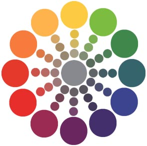

```{r, knitr-setup, include=FALSE, echo=FALSE}
require(knitr)
opts_chunk$set(background = 'white', cache=TRUE, tidy=FALSE)
opts_chunk$set(size = 'footnotesize')
options(width=55) # limit width of output so that it fits on the slide
opts_chunk$set(fig.width=6, fig.height=4, out.width='.9\\linewidth', fig.align='center')
```


## Cost of an Education?


http://junkcharts.typepad.com/junk_charts/2012/05/spring-flowers-and-striking-hours.html

## Cost of an Education!


- ... some charts are easier to read. 
- we will be talking about why

## Good Graphics

Graphics consist of

-  Structure (boxplot, scatterplot, etc.)
-  Aesthetics: features such as color, shape, and size that map other characteristics to structural features

Both the structure and aesthetics should help viewers interpret the information.

## Outline

- Cognitive aspects of perception and aesthetic choices 
- Visual ordering mechanisms and color choices
- Faceting graphs to show additional variables


## Pre-Attentive Features


- pre-attentive: things that "jump out" in less than 250 ms (less than the time for a blink of an eye)
- Color, form, movement, spatial localization

```{r, preattentive1,echo=FALSE,include=FALSE, fig.width=4, fig.height=4}
data <- data.frame(expand.grid(x=1:6, y=1:6), color=sample(c(1,2), 36, replace=TRUE))
data$x <- data$x+rnorm(36, 0, .25)
data$y <- data$y+rnorm(36, 0, .25)
suppressWarnings(library(ggplot2))
new_theme_empty <- theme_bw()
new_theme_empty$line <- element_blank()
new_theme_empty$strip.text <- element_blank()
new_theme_empty$axis.text <- element_blank()
new_theme_empty$plot.title <- element_blank()
new_theme_empty$axis.title <- element_blank()
new_theme_empty$plot.margin <- structure(c(0, 0, -1, -1), unit = "lines", valid.unit = 3L, class = "unit")

data$shape <- c(rep(2, 15), 1, rep(2,20))
library(scales)
qplot(data=data, x=x, y=y, color=factor(1, levels=c(1,2)), shape=factor(shape), size=I(5))+scale_shape_manual(guide="none", values=c(19, 15)) + scale_color_discrete(guide="none") + new_theme_empty

data$shape <- c(rep(2, 25), 1, rep(2,10))
qplot(data=data, x=x, y=y, color=factor(shape), shape=I(19), size=I(5))+scale_shape_manual(guide="none", values=c(19, 15)) + scale_color_discrete(guide="none") + new_theme_empty
```

Can you spot the odd one out? 


&nbsp;&nbsp;&nbsp;&nbsp;&nbsp;


nice applet by [Chris Healey](http://www.csc.ncsu.edu/faculty/healey/PP/)

## Hierarchy of Features

- Color is stronger than shape 

- Combination of pre-attentive features is usually not pre-attentive due to interference.

Can you spot the odd one out? 

```{r, preattentive2,echo=FALSE,include=FALSE, fig.width=4, fig.height=4}
set.seed(20140501)
data <- data.frame(expand.grid(x=1:6, y=1:6), color=sample(c(1,2), 36, replace=TRUE))
data$x <- data$x+rnorm(36, 0, .25)
data$y <- data$y+rnorm(36, 0, .25)
suppressWarnings(library(ggplot2))
new_theme_empty <- theme_bw()
new_theme_empty$line <- element_blank()
new_theme_empty$rect <- element_blank()
new_theme_empty$strip.text <- element_blank()
new_theme_empty$axis.text <- element_blank()
new_theme_empty$plot.title <- element_blank()
new_theme_empty$axis.title <- element_blank()
new_theme_empty$plot.margin <- structure(c(0, 0, -1, -1), unit = "lines", valid.unit = 3L, class = "unit")

data$shape <- data$color
qplot(data=data, x=x, y=y, color=factor(color), shape=factor(shape), size=I(5))+scale_shape_manual(guide="none", values=c(19, 15)) + scale_color_discrete(guide="none") + new_theme_empty


data$shape[1] <- if(data$shape[1]==2) 1 else 2
qplot(data=data, x=x, y=y, color=factor(color), shape=factor(shape), size=I(5))+scale_shape_manual(guide="none", values=c(19, 15)) + scale_color_discrete(guide="none") + new_theme_empty
```


&nbsp;&nbsp;&nbsp;&nbsp;&nbsp;


## 'Features' in ggplot2

- Features in ggplot2 are called ***aesthetics***

- main ones: colour, size, shape, alpha value

- ... let's play with them a bit ...

## Your Turn
Find ways to improve the following graphic: 

- Make sure the "oddball" stands out while keeping the information on the groups
- Hint: ```interaction``` combines factor variables

```{r, yourturn1, tidy=FALSE, fig.height=1.15, fig.width=1.25}
frame <- data.frame(x=runif(25), y=runif(25),
  g1=rep(c("A","B"), c(12,13)),
	g2=rep(c("1", "2"), c(13,12)))
qplot(x,y, shape=g1, colour=g2, data=frame, size=I(4))
```


## Color

- Hue: shade of color (red, orange, yellow...)
-  Intensity: amount of color
-  Both color and hue are pre-attentive. Bigger contrast corresponds to faster detection.



## Color is context-sensitive


The exact same hue and intensity in one situation may appear to be a different color in a different context. 

A and B are the same intensity and hue, but appear to be different.


## Data Quantities

```{r, ordering,echo=FALSE,include=FALSE, fig.width=3, fig.height=3}
library(RColorBrewer)
data <- data.frame(x=c(1, 2, 3, 4, 5), y=c(1, 4, 9, 10, 12), size=c(1, 4, 2, 1, 5))
qplot(data=data, x=x, y=y, size=size, geom="point") + scale_size_continuous(range=c(2.5,5), guide="none") + theme_bw()  + theme(axis.text=element_blank())
data <- data.frame(x=factor(c(1, 2, 3, 4, 5)), y=c(4, 3, 1, 5, 2))
ggplot(data=data, aes(x=x, weight=y)) + geom_bar() + theme_bw() + theme(axis.text=element_blank())
data <- data.frame(expand.grid(x=1:6, y=1:2), color=c(brewer.pal(7,"Blues")[2:7], brewer.pal(6,"Set1")))
ggplot(data=data, aes(x=x, y=factor(y), color=color))+geom_point(size=5)+ scale_color_identity() + ylab("") + xlab("") + theme_bw() + theme(axis.text=element_blank())
```
Which is bigger?

- Position: higher is bigger (y), items to the right are bigger (x) 
- Size, Area
- Color: not always ordered. More contrast = bigger.
- Shape: Unordered.

 &nbsp; &nbsp; &nbsp; 
 &nbsp; &nbsp; &nbsp; 


## Aesthetics in ggplot2 

from ggplot2's [online help](http://docs.ggplot2.org/current/)


## Using Color

```{r, gradients,echo=FALSE, include=FALSE, fig.width=3, fig.height=1}
data <- data.frame(x=1:7, blues = brewer.pal(7, "Blues"), set1=brewer.pal(7, "Set1"), diverge=brewer.pal(7,"RdBu"))
qplot(data=data, xmin=x-.5, xmax=x+.5, ymin=0, ymax=1, geom="rect", color=I("black"), fill=set1)+scale_fill_identity()+ ylab("") + xlab("") + theme(axis.text=element_blank(), axis.ticks=element_blank(), rect=element_blank()) + coord_fixed(ratio=1)+ new_theme_empty
qplot(data=data, xmin=x-.5, xmax=x+.5, ymin=0, ymax=1, geom="rect", color=I("black"), fill=blues)+scale_fill_identity()+ ylab("") + xlab("") + theme(axis.text=element_blank(), axis.ticks=element_blank(), rect=element_blank()) + coord_fixed(ratio=1)+ new_theme_empty
qplot(data=data, xmin=x-.5, xmax=x+.5, ymin=0, ymax=1, geom="rect", color=I("black"), fill=diverge)+scale_fill_identity()+ ylab("") + xlab("") + theme(axis.text=element_blank(), axis.ticks=element_blank(), rect=element_blank()) + coord_fixed(ratio=1)+ new_theme_empty
```

- Qualitative schemes: (not a lot more than 7 colors) 

Quantitative schemes:

- use color gradient with only one hue for positive values
  

- use color gradient with two hues for positive and negative values. Gradient should go through a light, neutral color (white)<br>
  
- Small objects or thin lines need more contrast than larger areas


## RColorBrewer
```{r, brewerloadpic,eval=TRUE,echo=FALSE,include=TRUE, fig.width=5, fig.height=8, out.width='.9\\linewidth'}
library(RColorBrewer)
display.brewer.all()
```

R package based on Cynthia Brewer's color schemes [ColorBrewer2.org](http://www.ColorBrewer2.org)

```{r, brewerload,eval=FALSE,include=TRUE,size='scriptsize'}
install.packages("RColorBrewer")
library(RColorBrewer)
help(package=RColorBrewer)
display.brewer.all()
```


## Color in ggplot2 


-  factor variable: ```scale_colour_discrete```, ```scale_colour_brewer(palette=...)```

- continuous variable:

```scale_colour_gradient``` (define low, high values) 

```scale_colour_gradient2``` (define low, mid, and high values)

- equivalent scales for ```scale_fill_XXX```


## Your Turn

- In the diamonds data, clarity and cut are ordinal, while price and carat are continuous
- Find a graphic that gives an overview of these four variables while respecting their types
```{r, yourturn2,echo=TRUE, fig.width=7, fig.height=4, out.width='.55\\linewidth', fig.align='center', size='footnotesize'}
data(diamonds)
qplot(carat, price, shape=cut, colour=clarity,
      data=diamonds)
```


## Facetting


- A way to extract subsets of data and place them side-by-side in graphics
- Syntax: ```facets = row ~ col``` Use ```.``` if there is no variable for either row or column (i.e. ```facets = . ~ col```)

```{r, diamondsdemo,echo=TRUE,size='scriptsize',eval=TRUE, fig.width=10, fig.height=2}
qplot(price, carat, data=diamonds, color=color,
      facets = . ~ clarity)
```


## Your Turn

- The ```movies``` dataset contains information from IMDB.com including ratings, genre, length in minutes, and year of release.

- Explore the differences in length, rating, etc. in movie genres over time

- Hint: use facetting!